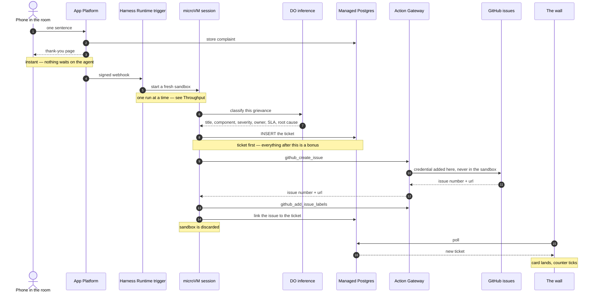
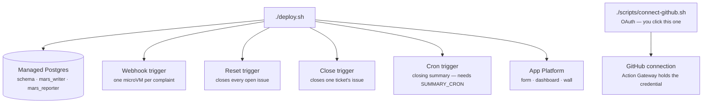
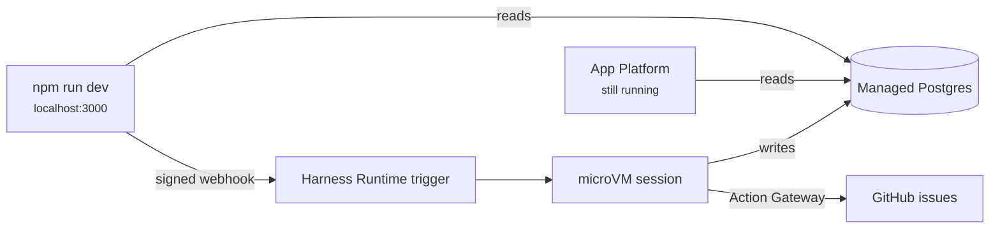

# Facility Issue Tracker

A live demo for DigitalOcean **Managed Agents Runtime Services**.

A QR code on screen points at a form with one field: *"Complain about anything.
One sentence."* Every submission spawns its own microVM, which takes the
grievance completely seriously and files it as an enterprise incident ticket.
The room watches its own nonsense land on a wall in real time.

> *"The lift plays jazz."*
> → **P4** · Elevators & Vertical Transit · owner Facilities · SLA 168h
> **Unsolicited Ambient Music Genre Broadcast Within Vertical Transit Infrastructure**
> *Elevator audio subsystem defaulted to jazz preset following maintenance cycle firmware reset.*

Every card on that wall is a webhook, a fresh microVM, an LLM call, a database
write, a GitHub issue, and a live push to the browser — about a minute, end to
end, for roughly 20¢.

---

## What happens when someone submits



The web tier never sees the ticket get written. That is the point of the
shape: 200 people can submit at once and the form stays instant, because
nothing on the request path waits for an agent.

### Throughput

What it does **not** do today is run them all at once. A Harness Runtime
trigger executes **one session at a time**, so complaints queue and land about
a minute apart. Measured, not estimated — three submitted in the same second
finished at +74s, +135s and +192s.

The limit is per *trigger*, not per team, so the fix is several intake
triggers with submissions round-robined across them. That is
[BACKLOG #21](docs/BACKLOG.md) and it is not built yet. Until it is, plan
around a queue with a one-minute service time rather than a thundering herd.

---

## Deploy it

You need `doctl` (authenticated), `node` 22+, `jq`, and a GitHub repo the
DigitalOcean GitHub app can read.

```bash
cp .env.example .env     # DIGITALOCEAN_ACCESS_TOKEN, GITHUB_REPO, ADMIN_PASSWORD
./deploy.sh
```



Re-running is safe; every step checks for what it already made.

Then one step that cannot be automated, because it is OAuth — authorizing
GitHub, so the agents can file issues:

```bash
./scripts/connect-github.sh    # prints a link; open it, approve
```

Skip it and the demo still works, minus the issues. `deploy.sh` tells you
which of the two states you are in rather than assuming.

**Cost while it's up:** about $5/mo for the app and $15/mo for the database,
plus roughly **20¢ per complaint** in sandbox time and tokens — call it $20
for a 100-person room. `./destroy.sh` removes all of it.

---

## Run the demo

| Screen | URL |
| --- | --- |
| Project this first | `/qr` — full-screen QR pointing at the form |
| Project this during | `/admin/wall` — the live card wall |
| For you | `/admin` — volumes, filters, the summary |

Sign in with `ADMIN_PASSWORD`.

**The arc.** Put the QR up and let the room submit. The first card lands in
about a minute and the rest follow roughly a minute apart. The session counter
on the wall ticks as sandboxes come and go — that's the scale story, without
anyone saying the word. Close with the executive summary: total tickets, top
three components, and a straight-faced headcount ask for Facilities. Set
`SUMMARY_CRON` to have it fire on schedule, or press **Generate now** on
`/admin/summary`.

**Closing one ticket.** Every row on `/admin/tickets`, and every card on the
dashboard, has a **Close** button. The ticket closes immediately; its GitHub
issue is closed a minute or so later by an agent, because only a
trigger-started session can reach Action Gateway. The badge says which of the
two has happened. The projected wall has no Close button on purpose.

**Reset demo**, beside Sign out, wipes the database and has an agent close
every open issue. Ticket numbering continues from GitHub's highest issue, so
the two stay in step.

**Between run-throughs.** `./scripts/clear-issues.sh` *deletes* every issue in
the tracker, wipes the database, and re-aligns the numbering. It asks before
it does anything, and it runs as your own `gh` login — the demo itself can
create and close issues but deliberately cannot delete them.

**Rehearsing.** `node scripts/seed.js --fake -n 20` fills the wall instantly:
no agents, no cost, deterministic rows. Use it for layout and for checking the
projector.

Dropping `--fake` runs the real thing — one microVM and one GitHub issue per
complaint, one after another. That is the only way to rehearse the agent, but
it spends sandbox time and leaves real issues in the tracker.
`npm run db:reset -- --yes` wipes the database between run-throughs (it names
the cluster before it does anything); the issues you close or delete yourself.

---

## Running it locally

There is no local database. A local run points at the cluster you deployed,
so what you develop against is what the demo runs on — and it is also how you
present if the venue blocks your App Platform URL.

```bash
npm install
./scripts/link-local.sh > .env.local
npm run dev
```



Submissions still fire the live trigger and still spawn real microVMs; only
the web tier has moved. There is no in-process shortcut — the agent's
instructions live in `agents/complaint-prompt.txt` and that is the only copy,
so what you test is what the demo runs.

Iterating on that prompt: edit it, `./deploy.sh` to push it to the trigger,
then submit. For layout and CSS work, `node scripts/seed.js --fake -n 20`
fills the wall instantly without touching an agent.

---

## Worth knowing

- **Nothing fails closed.** Model output is snapped to the controlled
  vocabulary rather than validated strictly — a slightly-wrong ticket beats a
  missing one in front of an audience.
- **Submissions are data, not instructions.** Anything trying to give the
  agent orders gets filed under `Human Factors`.
- **The agent's database role can insert a ticket, close a complaint and link
  an issue — nothing else.** It cannot read what anyone wrote, and cannot
  delete. Enforced by Postgres grants, asserted at deploy time.
- **Each ticket also opens a GitHub issue**, labelled by severity and
  component, through Action Gateway — which holds the credential and supplies
  it when the tool runs, so no GitHub token ever reaches the sandbox. The
  database row is written first and the issue second, so a tracker failure
  costs a link, not a ticket.
- **Authorize GitHub with `./scripts/connect-github.sh`, not the control
  panel.** Action Gateway resolves a connection by *actor*, and a
  trigger-started session runs as your DigitalOcean account UUID — not your
  username. A connection authorized against any other actor is invisible
  here, and the only symptom is issues silently never appearing. The script
  always targets the right one.
- **Where the minute goes.** Tool execution is about 10s of it; the rest is
  sandbox startup and model generation. Installing the Postgres client the
  image lacks costs under 2s, so that is not the thing to optimise.
- **The form is rate limited** (12 per IP per minute), and the inference
  service allows 240 requests/minute per team. Neither is the constraint
  today — the one-run-at-a-time trigger is.

---

## More

- [docs/ARCHITECTURE.md](docs/ARCHITECTURE.md) — how the app is put together
- [docs/PLATFORM-NOTES.md](docs/PLATFORM-NOTES.md) — what the platform actually
  does, as opposed to what you would reasonably assume
- [docs/BACKLOG.md](docs/BACKLOG.md) — known work, and why each item matters
