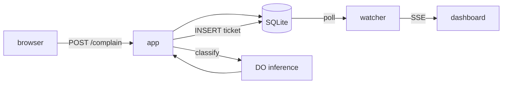
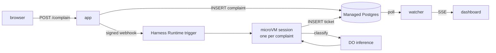

# Architecture

How the app is put together. For running the demo, see the [README](../README.md).

## Two ingest modes

`INGEST_MODE` decides how a grievance becomes a ticket. The app is otherwise
identical in both.

### `local` — development



One process, one SQLite file. Use this to build. You still need a DigitalOcean
credential, because inference runs there.

### `mars` — the demo



The app never sees the ticket get written. That is the point: 200 people can
submit at once, the web tier stays a web server, and the room watches dozens of
isolated sandboxes spin up and finish.

**Why polling.** In `mars` mode the `INSERT` happens inside an agent's sandbox
on another machine. The database is the only thing both sides can observe, so
`src/lib/ticket-watcher.js` polls it and fans out over SSE. The same loop covers
`local` mode for free.

---

## Inference

Every model call — the app's in `local` mode, and the Harness Agent's in `mars`
mode — goes through **DigitalOcean serverless inference** at
`https://inference.do-ai.run`. Nothing talks to `api.anthropic.com`.

The service speaks the Anthropic Messages API and accepts either `x-api-key` or
`Authorization: Bearer`, so [`src/lib/inference.js`](../src/lib/inference.js) uses
the official Anthropic SDK with nothing but a `baseURL` swap. The Harness Agent
gets there the same way, via `ANTHROPIC_BASE_URL` in its manifest.

Model ids are **DigitalOcean slugs**, not Anthropic ids:

```bash
doctl serverless-inference models list
```

`anthropic-claude-opus-5` is the default. `anthropic-claude-haiku-4.5` is
roughly 3× faster and noticeably blander — the deadpan is most of the joke, so
spend the latency.

### Two things worth knowing

**`output_config.format` is silently ignored.** Structured outputs return
free-form prose with no error and a `200`. This is why classification uses a
**forced tool call** (`tool_choice: {type: "tool"}`) instead — that path is
honoured in full, `enum` constraints included. Verified directly against the
endpoint; don't "simplify" it back to structured outputs.

**Rate limits are per-team and visible on every response.** Measured at 240
requests/minute and 5M tokens/minute. A 200-person room submitting at once fits,
but not twice in the same minute — `RATE_MAX` on the public form is the backstop.

---

## The write boundary

The brief asks for the agent's write tool to "allow for that one table and deny
for everything else". A tool policy over a raw SQL connection cannot enforce
that, so [`db/grants.postgres.sql`](../db/grants.postgres.sql) enforces it where it
cannot be argued with — Postgres itself. The agent connects as `mars_writer`:

| Object | Permission |
| --- | --- |
| `tickets` | `INSERT` only |
| `complaints` | `UPDATE (status, error, session_id)` only — no `SELECT` |
| `summaries` | none |
| everything else | none, including future tables |

No `DELETE`, no `DROP`, no read access to complaint bodies it was not handed.

The scheduled summary agent gets a second role, `mars_reporter`: `SELECT` on
`tickets` and `INSERT` on `summaries`, nothing more. It never sees a complaint
body and cannot edit the tickets it reports on.

On top of that, the manifests set `permissions.default: deny` and allow exactly
one tool (`action_code`), with a read-only filesystem and egress restricted to
the inference host plus the VPC.

---

## Layout

```
src/
  server.js              Express app, startup, graceful shutdown
  config.js              Env parsing + startup validation
  db/
    index.js             Driver-agnostic query layer
    sqlite.js            Local driver (node:sqlite, no native build)
    postgres.js          Managed Postgres driver
  lib/
    ticket-schema.js     The fixed schema, the vocabularies, the system prompt
    inference.js         DigitalOcean serverless inference client
    classify.js          Grievance → ticket (forced tool call)
    summarize.js         The closing executive summary
    mars.js              Webhook signing + the session census
    ingest.js            Submission pipeline for both modes
    ticket-watcher.js    DB poll → event bus
    events.js            In-process fan-out to SSE
    auth.js              Signed-cookie admin session
  routes/                public · admin · api (SSE)
views/                   EJS, no build step
public/                  CSS + the SSE client
db/                      Schemas for both engines, plus the grants
agents/                  Harness Agent manifests + trigger prompts
                         complaint-agent.yaml   webhook: one session per grievance
                         summary-agent.yaml     cron: the closing summary
scripts/                 init · seed · reset
```

Both drivers speak `?` placeholders; the Postgres driver rewrites them to
`$1..$n`. Keep `db/schema.sqlite.sql` and `db/schema.postgres.sql` in step.

---

## Notes for the stage

- **Nothing fails closed.** Model output is snapped to the controlled
  vocabulary rather than validated strictly (`coerceTicket`), because a
  slightly-wrong ticket beats a missing one in front of an audience.
- **Prompt injection is handled as content.** A submission that tries to give
  instructions gets filed under `Human Factors` rather than obeyed.
- **The form is rate limited** (`RATE_MAX` per `RATE_WINDOW_MS` per IP) so one
  enthusiast cannot drown the demo.
- **SSE reconnects with backoff**, so restarting the server mid-talk recovers
  quietly rather than leaving a dead wall.
- **`/admin` and `/api` are the only protected routes.** The form is public by
  design.
