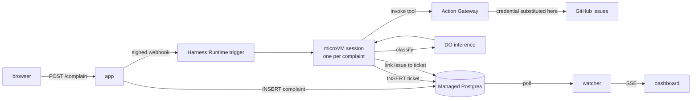

# Architecture

How the app is put together. For running the demo, see the [README](../README.md).

## How a complaint becomes a ticket



Note where the GitHub credential is, and is not. It lives in an Action
Gateway connection and is substituted at tool-execution time, so it never
enters the sandbox — unlike the database URL, which is a session secret the
agent can read. That asymmetry is the argument for routing more things
through the gateway as the catalogue grows.

The ticket is written before the issue, deliberately. GitHub is the step most
likely to fail on a conference network, and a ticket that lands without a
link is a far better outcome than a run that dies holding a good ticket. The
agent is told not to retry the insert and not to treat a GitHub failure as a
failed run.

The app never classifies anything and never writes a ticket. It stores the
complaint, fires a signed webhook, and reads the result back later.

There is deliberately no in-process alternative. An earlier version had one,
and the two copies of the prompt drifted within a day — the in-process copy
kept an example that had already been found to make the agent file the
example instead of the complaint. The instructions now live in exactly one
place, `agents/complaint-prompt.txt`, and the only way to run them is the way
the demo does.

**Why polling.** The `INSERT` happens inside an agent's sandbox on another
machine. The database is the only thing both sides can observe, so
`src/lib/ticket-watcher.js` polls it and fans out over SSE.

## Inference

Every model call — the agents' classification, and the app's executive
summary — goes through **DigitalOcean serverless inference** at
`https://inference.do-ai.run`. Nothing talks to `api.anthropic.com`.

The service speaks the Anthropic Messages API and accepts either `x-api-key` or
`Authorization: Bearer`, so [`src/lib/inference.js`](../src/lib/inference.js) uses
the official Anthropic SDK with nothing but a `baseURL` swap. The Harness Agent
gets there the same way, via `ANTHROPIC_BASE_URL` in its manifest.

Model ids are **DigitalOcean slugs**, not Anthropic ids:

```bash
doctl serverless-inference models list
```

`anthropic-claude-opus-5` is the default. `anthropic-claude-haiku-4.5` is
roughly 3× faster and noticeably blander — the deadpan is most of the joke, so
spend the latency.

### Two things worth knowing

**`output_config.format` is silently ignored.** Structured outputs return
free-form prose with no error and a `200`. This is why `summarize.js` uses a
**forced tool call** (`tool_choice: {type: "tool"}`) instead — that path is
honoured in full, `enum` constraints included. Verified directly against the
endpoint; don't "simplify" it back to structured outputs.

**Rate limits are per-team and visible on every response.** Measured at 240
requests/minute and 5M tokens/minute. A 200-person room submitting at once fits,
but not twice in the same minute — `RATE_MAX` on the public form is the backstop.

---

## The write boundary

The brief asks for the agent's write tool to "allow for that one table and deny
for everything else". A tool policy over a raw SQL connection cannot enforce
that, so [`db/grants.postgres.sql`](../db/grants.postgres.sql) enforces it where it
cannot be argued with — Postgres itself. The agent connects as `mars_writer`:

| Object | Permission |
| --- | --- |
| `tickets` | `INSERT`; `SELECT (id)`; `UPDATE (issue_number, issue_url)` |
| `complaints` | `SELECT (id)`; `UPDATE (status, error, session_id)` |
| `summaries` | none |
| everything else | none, including future tables |

Those column-level `SELECT`s are not decoration. `INSERT ... RETURNING id` and
`UPDATE ... WHERE id = %s` are both reads, and denying them fails as a bare
"permission denied for table" — which then rolls back the surrounding
transaction and takes the good INSERT with it. Granting exactly `id` keeps
every ticket title, root cause and complaint body unreadable to the writer.

No `DELETE`, no `DROP`, no read access to what anyone actually wrote.

The scheduled summary agent gets a second role, `mars_reporter`: `SELECT` on
`tickets` and `INSERT` on `summaries`, nothing more. It never sees a complaint
body and cannot edit the tickets it reports on.

On top of that the complaint manifest attaches exactly three Action Gateway
tools — `github_create_issue`, `github_add_issue_labels`,
`github_create_label` — out of a catalogue of 1,200 across twelve toolkits.
Jira, Supabase, Sentry and a 310-tool DigitalOcean kit stay out of reach of a
sandbox that files complaints about cold coffee.

What the manifests do *not* set is `permissions.default: deny`, and egress
ships unrestricted: under deny the agent loses its own shell and falls back to
`action_code`, which cannot see session secrets, and the tight egress form
does not hold in trigger-started sessions. Both are platform behaviours rather
than choices — see [PLATFORM-NOTES.md](PLATFORM-NOTES.md). The grants above are
the boundary that actually holds.

---

## Layout

```
src/
  server.js              Express app, startup, graceful shutdown
  config.js              Env parsing + startup validation
  db/
    index.js             Query layer — every statement lives here
    postgres.js          Connection pool, TLS, ?→$n placeholders
    ssl.js               Cluster CA verification, sslmode handling
  lib/
    ticket-schema.js     Controlled vocabularies + coercion (no prompt here)
    inference.js         DigitalOcean serverless inference client
    summarize.js         The closing executive summary
    mars.js              Webhook signing + the session census
    ingest.js            Store the complaint, fire the webhook, walk away
    ticket-watcher.js    DB poll → event bus
    events.js            In-process fan-out to SSE
    auth.js              Signed-cookie admin session
  routes/                public · admin · api (SSE)
views/                   EJS, no build step
public/                  CSS + the SSE client
db/                      Schema and the least-privilege grants
agents/                  Harness Agent manifests + trigger prompts
                         complaint-agent.yaml   webhook: one session per grievance
                         summary-agent.yaml     cron: the closing summary
scripts/                 deploy helpers and operational tools
                         connect-github.sh   the one OAuth step
                         link-local.sh       point a local run at the cluster
                         migrate-postgres.js schema, roles, privilege asserts
                         render-spec.js      App Platform spec templating
                         seed.js · reset.js · init-db.js
```

The query layer writes `?` placeholders and the driver rewrites them to
`$1..$n`, so the SQL reads the same as `db/schema.postgres.sql`.

---

## Notes for the stage

- **Nothing fails closed.** Model output is snapped to the controlled
  vocabulary rather than validated strictly (`coerceTicket`), because a
  slightly-wrong ticket beats a missing one in front of an audience.
- **Prompt injection is handled as content.** A submission that tries to give
  instructions gets filed under `Human Factors` rather than obeyed.
- **The form is rate limited** (`RATE_MAX` per `RATE_WINDOW_MS` per IP) so one
  enthusiast cannot drown the demo.
- **SSE reconnects with backoff**, so restarting the server mid-talk recovers
  quietly rather than leaving a dead wall.
- **`/admin` and `/api` are the only protected routes.** The form is public by
  design.
